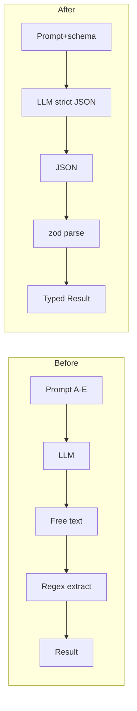

# AI 直接返回结构化 JSON（OpenAI Structured Outputs）

Date: 2026-04-30
Status: Draft for review
Owner: lib/ai/*

## 1. 背景与问题

当前 `lib/ai/generate-proposal.ts` 让模型用自然语言输出五个小节（A./B./C./D./E.），再通过正则把文本切片：

- `extractSection(text, "A.")` → 需求摘要
- `extractSection(text, "B.")` → 缺失信息
- `extractSection(text, "C.")` → 方案草稿
- `extractSectionBody(text, "D.")` → 建议标题
- `parseTags(text)`（基于 `E.` 段中的 JSON）→ 标签

这一层对模型输出格式高度敏感，已观察到的失败模式：

1. 模型用 markdown 加粗写小节标题，例如 `**D. 建议标题**` / `**E. 案例标签**`，正则只匹配纯文本 `D.`，导致整段无法切出。
2. 模型在 E 段把 JSON 包在 ` ```json ... ``` ` 代码围栏里，需要额外清洗。
3. 模型偶尔漏写 D 或 E，没有任何 schema 校验提醒，结果就是 `suggestedTitle = undefined`、`tags = undefined`，case 的 title/tags 字段静默失更新。
4. 任何小节内文本中如果出现 `A.` / `B.` 等行首字符，会被误识别为新小节起点（虽然现在的实现已用 `^\s*(?:\*\*)?\s*` 限制，但再加一层 markdown 修饰就又破了）。

> 根因：**输出契约是「字符串 + 正则」而非「数据结构 + 校验」**。每加一种 markdown 修饰就要补一条正则，长期维护成本不可控。

## 2. 替代方案对比

| 方案 | 何物 | 改动量 | 类型安全 | 模型/接口兼容 | 结论 |
|---|---|---|---|---|---|
| pydantic-ai | Python 库，pydantic v2 schema → 强校验 | 极大（拆 Python sidecar） | 强 | OpenAI / Anthropic / Gemini | ❌ 仓库是 TS，否决 |
| Vercel AI SDK `generateObject(zodSchema)` | TS 生态 SDK，内置结构化输出 | 中（替换 provider，加 2 依赖） | 极强 | OpenAI 系 + 部分兼容服务 | 备选 |
| **OpenAI Structured Outputs（本方案）** | 直接在 `chat/completions` 请求里加 `response_format: { type: "json_schema", strict: true }` | 小（保留现有 `fetch` provider） | 强（OpenAI 端校验 + zod 二次校验） | OpenAI gpt-4o/4.1 系列；多数 OpenAI 兼容服务支持 `json_object` 降级 | ✅ 选用 |
| Instructor-js | 类 pydantic-ai 体验，自带 retry | 中 | 强 | 同上 | 不选（生态小） |

## 3. 方案 A 详细设计

### 3.1 输出 schema（zod）

新增 `lib/ai/proposal-schema.ts`：

```ts
import { z } from "zod";
import { CaseTagsSchema } from "@/lib/domain/case-tags";

export const InitialProposalJsonSchema = z.object({
  requirementSummary: z.string().min(1),
  missingInformation: z.string().min(1),
  proposalDraft: z.string().min(1), // 内含 1~7 节的 Markdown
  suggestedTitle: z.string().min(1).max(20),
  tags: CaseTagsSchema,
});

export const RevisionProposalJsonSchema = z.object({
  revisionNotes: z.string().min(1),
  proposalDraft: z.string().min(1),
  missingInformation: z.string().min(1),
  suggestedTitle: z.string().min(1).max(20),
  tags: CaseTagsSchema,
});

export type InitialProposalJson = z.infer<typeof InitialProposalJsonSchema>;
export type RevisionProposalJson = z.infer<typeof RevisionProposalJsonSchema>;
```

> 长文本（方案草稿 1500 字）保持为单字段 Markdown，不再继续拆嵌套结构 —— 避免 JSON 转义后的可读性问题。

### 3.2 Provider 接口扩展

`lib/ai/types.ts`：

```ts
import type { ZodType } from "zod";

export interface ProposalAiProvider {
  /** 兼容旧接口，保留给 mock / 单元测试。 */
  generateText(prompt: string): Promise<string>;
  /** 让模型直接返回符合 zod schema 的对象。 */
  generateJson<T>(
    prompt: string,
    schema: ZodType<T>,
    schemaName: string,
  ): Promise<T>;
}
```

### 3.3 OpenAI provider 实现

`lib/ai/openai-chat-provider.ts` 新增 `generateJson`：

```ts
import { zodToJsonSchema } from "zod-to-json-schema";

async generateJson<T>(prompt: string, schema: ZodType<T>, schemaName: string): Promise<T> {
  const jsonSchema = zodToJsonSchema(schema, { target: "openAi" });
  const res = await fetch(`${this.options.baseUrl}/chat/completions`, {
    method: "POST",
    headers: { ... },
    body: JSON.stringify({
      model: this.options.model,
      messages: [{ role: "user", content: prompt }],
      max_tokens: this.options.maxTokens,
      temperature: this.options.temperature,
      response_format: {
        type: "json_schema",
        json_schema: { name: schemaName, strict: true, schema: jsonSchema },
      },
    }),
  });
  const body = await res.json();
  // ...错误处理沿用现有逻辑
  const content = body.choices?.[0]?.message?.content;
  const parsed = JSON.parse(content);
  return schema.parse(parsed);
}
```

### 3.4 Mock provider 实现

`lib/ai/mock-provider.ts` 给 `generateJson` 返回一份与现有 mock 文案对应的写死对象（方便 dev/无 key 场景）。

### 3.5 Prompt 改写

`lib/ai/prompts.ts` 不再要求 `A./B./C./D./E.` 五段。要点：

- 保留"资深生物信息分析方案顾问"角色
- 保留 `proposalStructure`（1~7 节）作为 `proposalDraft` 字段内的写作要求
- 保留 `tagFieldDescriptions`（标签枚举值），但写法改成"`tags` 字段必须是下列结构……"
- 末尾不再举正例 JSON（schema 已经强约束），只描述写作风格与篇幅

### 3.6 删除正则解析层

`lib/ai/generate-proposal.ts` 重写为直接转发：

```ts
export async function generateInitialProposalDraft(provider, input) {
  const data = await provider.generateJson(
    buildInitialProposalPrompt(input),
    InitialProposalJsonSchema,
    "InitialProposal",
  );
  return data; // 已是 ProposalDraftResult 形状
}

export async function generateRevisionProposalDraft(provider, input) {
  const data = await provider.generateJson(
    buildRevisionProposalPrompt(input),
    RevisionProposalJsonSchema,
    "RevisionProposal",
  );
  return {
    requirementSummary: "修订轮次沿用原始需求摘要。",
    ...data,
  };
}
```

`extractSection / extractSectionBody / parseTags / parseTagsFromJson` 全部删除。

## 4. 数据流对比



## 5. 降级与兼容

| 场景 | 方案 |
|---|---|
| 国内中转/自建模型不支持 `json_schema` | 新增环境变量 `AI_JSON_MODE=json_object`：请求体改为 `response_format: { type: "json_object" }`，并把 schema 摘要追加进 prompt |
| 模型偶发返回非法 JSON | `JSON.parse` 失败一次自动 retry，prompt 追加"上次输出不是合法 JSON，请只返回符合下列 schema 的 JSON 对象" |
| zod 二次校验失败 | 同上 retry 一次；仍失败则抛 `AIGenerationError("schema 校验失败")`，由调用方走"AI 已生成需求摘要，请分析人员确认"的占位逻辑 |
| `AI_PROVIDER=mock` | mock 直接返回固定对象，不走任何序列化 |

## 6. 新增依赖

| 包 | 用途 | 体积 |
|---|---|---|
| `zod-to-json-schema` | zod schema → JSON Schema（OpenAI dialect） | ~12KB MIT |

不引入 Vercel AI SDK / Instructor-js / openai SDK；继续使用现有 `fetch`。

## 7. 测试改造提纲

`tests/ai/generate-proposal.test.ts` 改造方向：

1. 把 `providerReturning(text)` 工具改为 `providerReturning(jsonObject)`：
   ```ts
   function providerReturning<T>(value: T): ProposalAiProvider {
     return {
       async generateText() { return JSON.stringify(value); },
       async generateJson() { return value as any; },
     };
   }
   ```
2. 删除以下用例（不再可能出现）：
   - "only treats line-start A/B/C markers as section boundaries"
   - "still parses A/B/C/D sections correctly when E is present"
   - "parses title and tags from markdown-bold headings"
   - "returns undefined tags when section E contains malformed JSON"
3. 新增用例：
   - `generateJson` 返回的对象直接被 `schema.parse` 校验通过
   - schema 校验失败 → retry 一次 → 仍失败抛 `AIGenerationError`
   - mock provider 的 `generateJson` 与 `generateText` 输出一致
   - 修订流程返回固定的 `requirementSummary`

## 8. 改动量预估（仅供后续 PR 参考，本次不动）

| 文件 | +/- |
|---|---|
| `lib/ai/proposal-schema.ts`（新增） | +30 |
| `lib/ai/types.ts` | +5 |
| `lib/ai/openai-chat-provider.ts` | +25 |
| `lib/ai/mock-provider.ts` | +10 |
| `lib/ai/prompts.ts` | -30 / +50 |
| `lib/ai/generate-proposal.ts` | -70 / +30 |
| `tests/ai/generate-proposal.test.ts` | -120 / +80 |
| `package.json` | +1 |

预计 +200 / -220，单 PR 可完成。

## 9. 风险与缓解

| 风险 | 缓解 |
|---|---|
| 中转服务不支持 `json_schema` | `AI_JSON_MODE=json_object` 降级路径 |
| `proposalDraft` 1500 字内含换行/引号被 JSON 转义 | 输出端字段是字符串，前端原样渲染；UI 已支持 Markdown |
| 模型仍偶发非法 JSON | 单次 retry + 兜底错误提示 |
| 现有测试需要重写 | 单 PR 一次性提交，CI 风险低 |
| 国内某些兼容接口对 `response_format` 字段不识别 | provider 加 try/catch：捕获到 400 后回退到无 `response_format` + 正则路径（保留旧解析层一段时间），可作为过渡期 fallback |

## 10. 实施顺序（后续 PR）

1. 新增 `proposal-schema.ts` + `zod-to-json-schema` 依赖
2. 扩展 `ProposalAiProvider` 接口 + mock 实现
3. 实现 `OpenAiChatProposalAiProvider.generateJson`，加 retry
4. 重写 prompt + `generate-proposal.ts`
5. 测试改造，跑 `npm run lint && npm test`
6. 灰度环境联调（先开 `json_object` 模式，确认中转兼容后切 `json_schema`）

## 11. 不在本次范围

- 不改任何 TS 源码
- 不动 `package.json`
- 不改测试
- 不切换 `AI_PROVIDER` 默认值
- 不引入 Vercel AI SDK / openai SDK

本次仅产出本设计稿，作为后续单独 PR 的依据。
